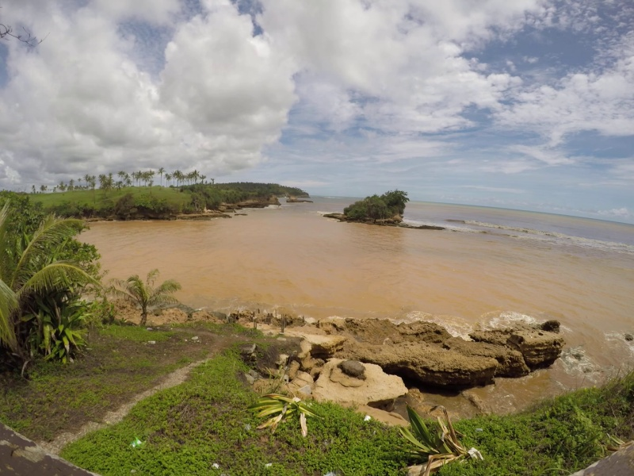
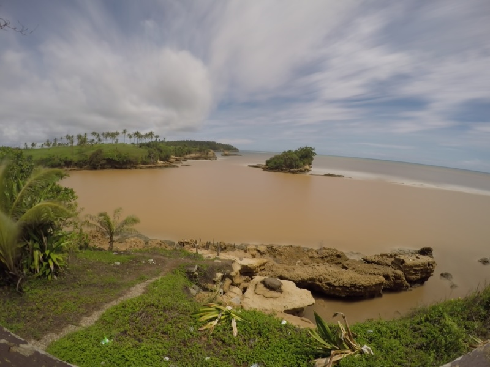
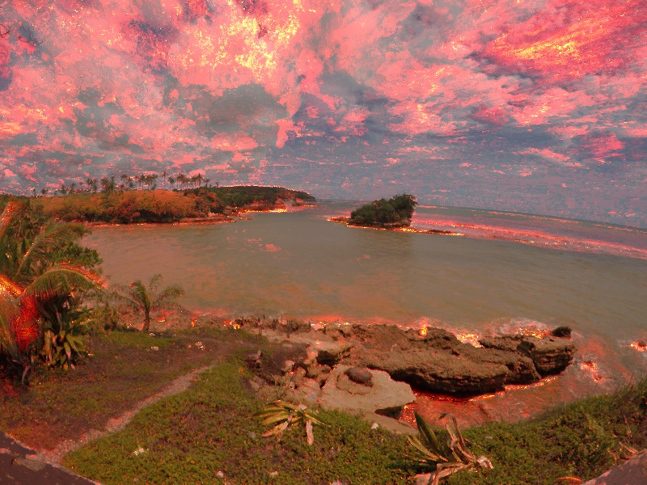
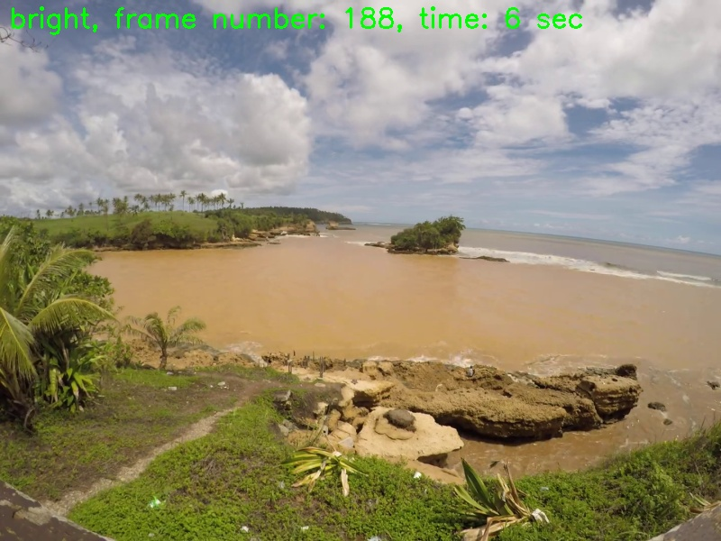
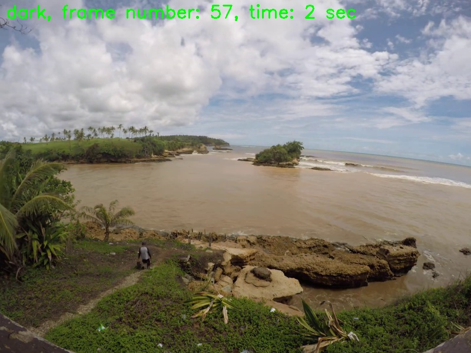

# Using Video Imagery to Study Coastal Changes

This repository shares some video processing techniques and codes to find meaningful insights from coastal videos.

**Requirements**

````python
>> pip install opencv-contrib-python
>> pip install numpy
>> pip install imutils
````


### Snapshot

The snapshot is the first frame of the video, just like a standard photo.



### Timex (time-exposure) image

A timex is a time-averaged image of all frames, smoothing away surface waves and determining the location of persistent wave-breaking (indicative of shallow sandbars).

````
python timex.py
````

**Output**



### Variance image

A “variance” image shows the standard deviation of pixel intensity throughout the video, and it is useful for determining how much variation or movement is occurring at a given location.

````
python variance.py
````

**Output**



### Bright image

A “bright” image shows the brightest pixel values throughout the video, useful for identifying the position of maximum wave run-up on the beach, position of all breaking waves, and sea-state.

````
python bright_dark.py
````



### Dark image

A “dark” image shows the darkest pixel values throughout the video, useful for tracking sediment plumes, tracking floating debris, and filtering out breaking waves.

````
python bright_dark.py
````




### Useful Links

- https://www.usgs.gov/centers/pcmsc/science/using-video-imagery-study-coastal-change-whidbey-island?qt-science_center_objects=0#qt-science_center_objects
- https://github.com/robertosannazzaro/motion-heatmap-opencv
- https://www.youtube.com/watch?v=ywWlDDcU5Q0

